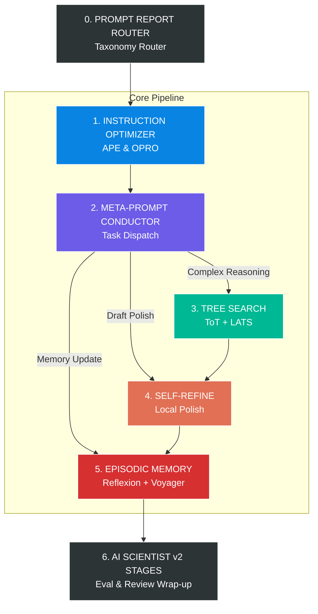

<div align="center">

# ⚙️ ARSENAL: Unified Master LLM Agent Pipeline

[](#)
[](https://www.python.org/)
[](LICENSE)

**A**utomatic **R**easoning, **S**earch, **E**valuation, **N**avigation, and **A**daptive **L**earning

**One complete master system that combines the strongest patterns from *ten* state-of-the-art research systems into a single unified operational arsenal.**

</div>

---

## 🌟 The 10-System Fusion

We extracted the core logic, prompts, and flows from the top 10 LLM agent frameworks and unified them.

| # | Source System | Paper | What we take for ARSENAL |
|---|---|---|---|
| 1 | **AI Scientist v2** | *SakanaAI* | Multi-stage progressive pipeline, BFTS node tree, multi-seed eval, writeup + peer review |
| 2 | **Self-Refine** | *arXiv:2303.17651* | Generate → Feedback → Refine loop, multi-aspect scoring, history-aware iteration |
| 3 | **Reflexion** | *arXiv:2303.11366* | Verbal reinforcement, episodic memory, trial-level reflection |
| 4 | **Meta-Prompting** | *arXiv:2401.12954* | Conductor / expert dispatch, tool experts (Python), intermediate feedback append |
| 5 | **Tree of Thoughts** | *arXiv:2305.10601* | Classic deliberate tree search: propose/sample × value/vote × BFS beam / DFS prune |
| 6 | **LATS** | *arXiv:2310.04406* | MCTS + UCT selection, LM value, expansion, rollout, backprop (+ env + reflection) |
| 7 | **APE** | *arXiv:2211.01910* | One-shot/bandit instruction search, likelihood/UCB ranking, demo functions |
| 8 | **OPRO** | *arXiv:2309.03409* | Iterative meta-prompt instruction search conditioned on score history |
| 9 | **Voyager** | *arXiv:2305.16291* | Automatic curriculum, skill library (procedural memory), iterative env-grounded code refine |
| 10| **Prompt Report** | *arXiv:2406.06608* | 58-technique taxonomy, technique family routing, best-practice selection |

## 🏗️ Architecture Design (How they fuse)



### 🧠 Design Principles
1. **Router first** — Prompt Report taxonomy chooses the technique family before any heavy loop.
2. **Optimize the instruction** — **APE** (one-shot/bandit) and/or **OPRO** (iterative score-conditioned meta-prompt search).
3. **Conduct, don't monolith** — Meta-Prompting decomposes work into expert subcalls.
4. **Search when uncertain** — L3: **ToT** offline baseline; **LATS** interactive/full; cascade when needed.
5. **Polish every candidate** — Self-Refine (and Voyager-style env critique for code/skills).
6. **Remember failures and skills** — **Reflexion** verbal episodic memory; **Voyager** skill library + automatic curriculum for open-ended procedural growth.
7. **Stage the pipeline** — AI Scientist v2 progressive stages wrap everything end-to-end with evaluation, writeup, and review.

## 📂 Repository Structure & Reading Order

```text
master-unified-pipeline/
├── README.md                      # (You are here)
├── research_summary.md            # Why this fusion exists
├── pattern_extraction.md          # Strongest loops & decisions per system
├── unified_architecture.md        # Full architecture deep-dive
├── CONSTITUTION.md                # Universal reusable prompt dossier
├── prompts_complete.md            # Master prompt library
├── python_logic_flow_complete.md  # Full logic, loops, and operational decisions
├── python_logic_inventory.json    # Logic map
├── deep_dive_task_matrix.md       # Phase × function matrix
├── graphs/                        # Mermaid graphs & visualizations
│   ├── MASTER_UNIFIED_ENGLISH.md
│   └── MASTER_UNIFIED_ARABIC.md
└── archives/
```

## 📜 The Constitution
Universal, domain-agnostic prompts distilled from all extracted systems can be found here:
**→ [`CONSTITUTION.md`](./CONSTITUTION.md)**

## 🔗 Source Extraction Repositories (All Public)
This master pipeline is the culmination of deep extractions from individual systems:
- [AI Scientist v2 Extractions](https://github.com/faresrafat3/ai-scientist-v2-prompts-extraction)
- [Self-Refine](https://github.com/faresrafat3/self-refine-full-extraction) | [Reflexion](https://github.com/faresrafat3/reflexion-full-extraction) | [Meta-Prompting](https://github.com/faresrafat3/meta-prompting-full-extraction)
- [Tree of Thoughts](https://github.com/faresrafat3/tot-full-extraction) | [OPRO](https://github.com/faresrafat3/opro-full-extraction) | [Voyager](https://github.com/faresrafat3/voyager-full-extraction)
- [LATS](https://github.com/faresrafat3/lats-full-extraction) | [APE](https://github.com/faresrafat3/ape-full-extraction) | [Prompt Report](https://github.com/faresrafat3/prompt-report-full-extraction)

**Consolidated Master Archive:** [LLM-Agent Research Extractions](https://github.com/faresrafat3/llm-agent-research-extractions)
